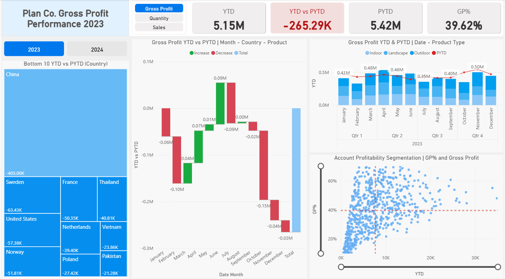
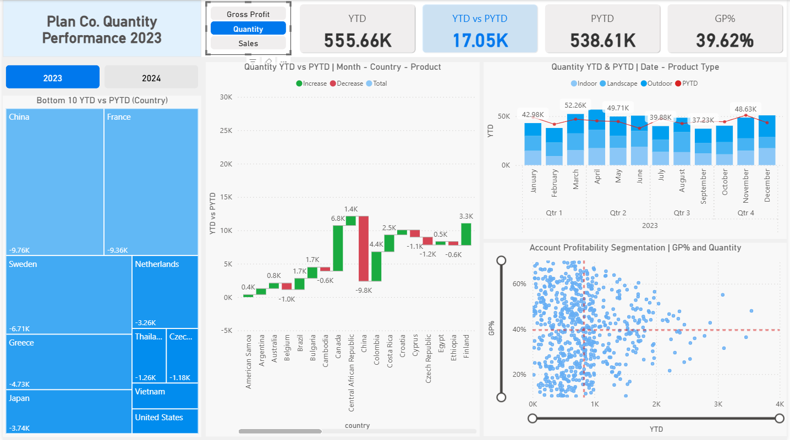
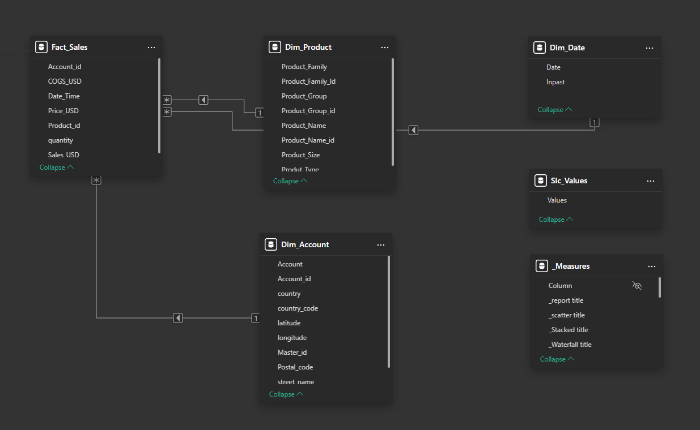

# Plan Co. Performance — Power BI (YTD vs PYTD)

[](#)
[](#)
[](#)
[](LICENSE)

A production-style **Power BI** project analyzing **Sales, Quantity, and Gross Profit** with **Year-to-Date** vs **Prior-Year-to-Date** variance, bottom-10 market detection, drilldowns, and an account profitability segmentation (GP% × YTD). It demonstrates **clear business framing**, **clean DAX**, and **decision-oriented visual design**.

> **Who this helps:** Sales/Finance leaders needing fast answers to *“Where are we underperforming vs last year?”* and *“Which accounts are profitable or volume-driven?”*

---

## 📸 Preview

<p align="center">
  
  
</p>
<p align="center">
  <em>  Gross Profit 2023  </em> | <em>  Quantity 2023 with Drilldown  </em>
</p>

---

## 🎯 Business Outcomes

- **Variance accountability:** Instantly see **YTD vs PYTD** totals and progression by **Month → Country → Product**.
- **Focus on risk:** **Bottom-10 TreeMap** isolates the worst YoY deltas by country.
- **Mix management:** **Product-type trend** (stacked YTD vs PYTD line) reveals category shifts.
- **Profitable growth:** **GP% vs YTD** scatter with average lines segments **high-margin** vs **high-volume** accounts for targeted actions.

---

## 🧠 Feature Highlights

- **Global metric switch**: Choose *Sales / Quantity / Gross Profit* once; **every visual updates**.
- **Dynamic, conditional cards**: YTD, PYTD, and **YTD vs PYTD** (blue for ↑, red for ↓).
- **Waterfall with drilldown**: Month → Country → Product to explain variance, not just show it.
- **“Same point last year” guard**: A custom `Inpast` flag prevents comparing against future days of last year.

---

## 🗂 Repository Structure

```
├─ assets/ # screenshots
├─ dax/ # modular measures (copy into _Measures table)
├─ data/ # data files
├─ powerbi/ # .pbix file
└─ README.md
```


---

## 🗺 Data Model (Star Schema)

**Fact_Sales** (Date_Time, Account_id, Product_id, Sales USD, COGS_USD, quantity)  
→ relates to **Dim_Date[Date]**, **Dim_Account[Account_id]**, **Dim_Product[Product_Name_id]**.



---


